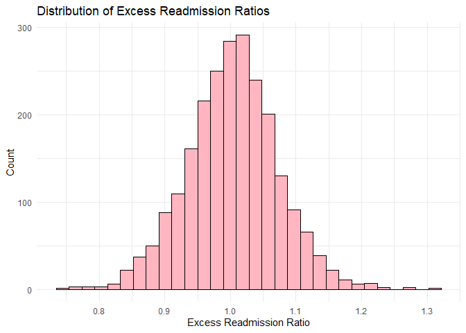
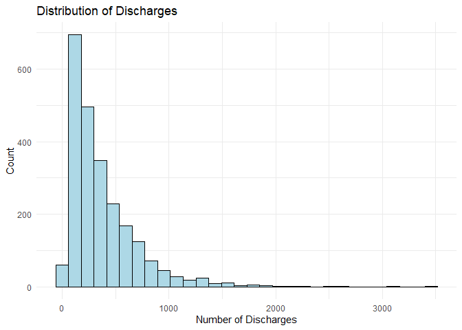
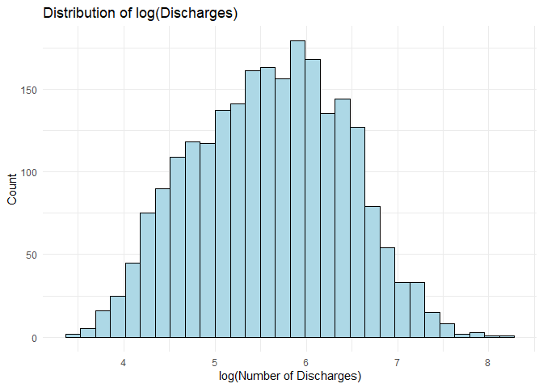
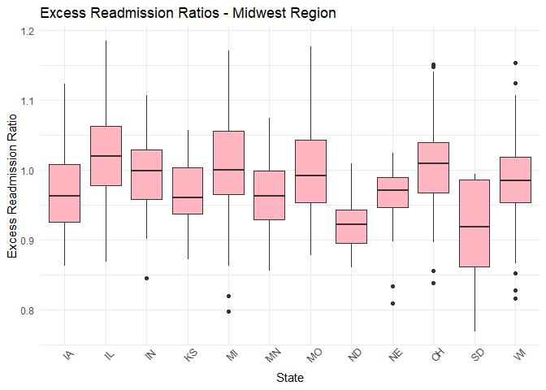
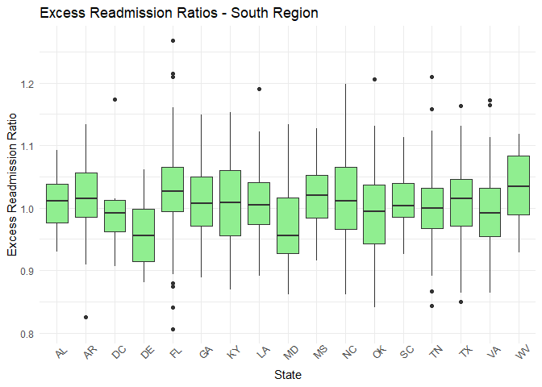
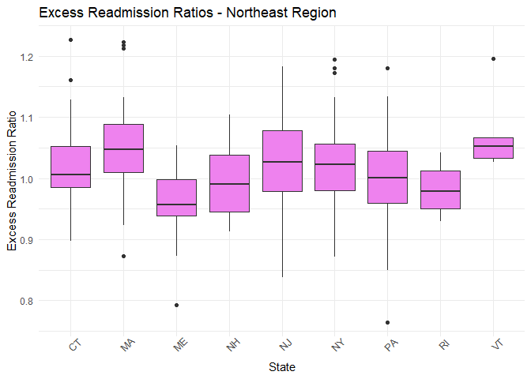
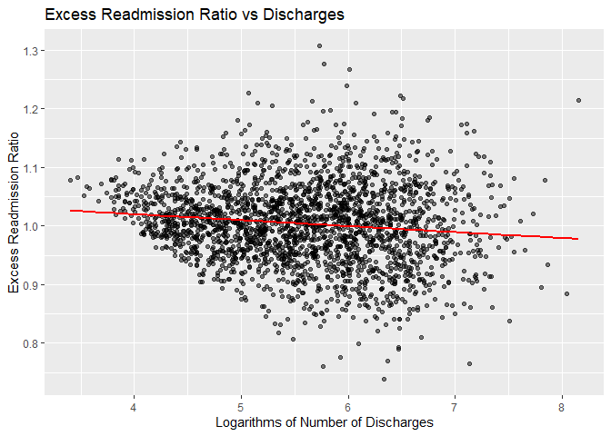
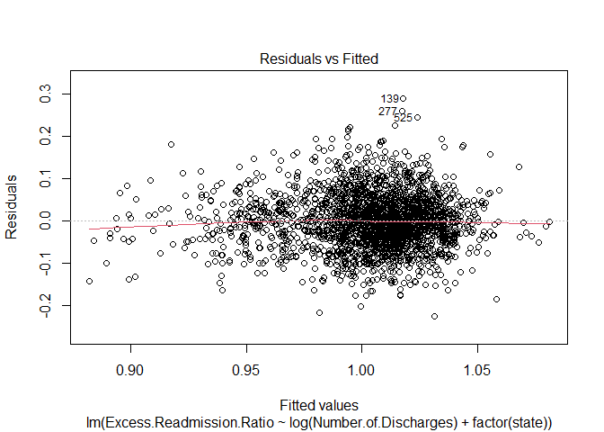
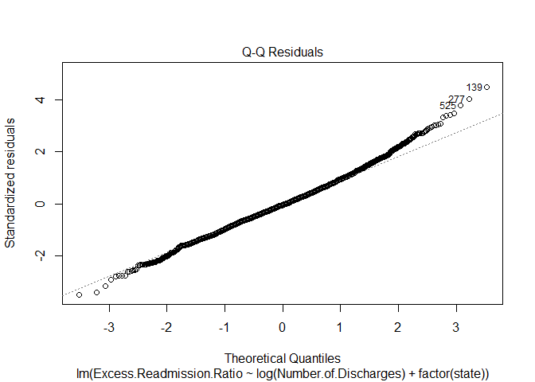
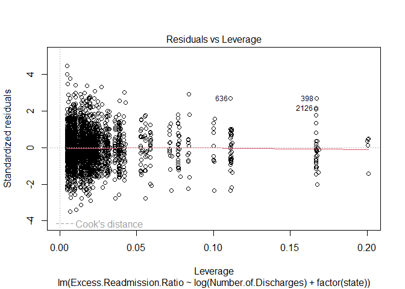

HRRP Heart Failure Readmissions
================
Nhi Nguyen
2025-12-22

## Introduction

This report examines U.S. hospital performance on 30-day excess
readmissions for heart failure under Medicare’s Hospital Readmissions
Reduction Program (HRRP). The analysis uses hospital-level data for the
heart failure measure READM-30-HF to study how excess readmission ratios
vary across states and with hospital volume. Excess readmission ratios
are risk-standardized performance metrics, where values above 1 indicate
more readmissions than expected and values below 1 indicate
better-than-expected outcomes.

The main empirical question is whether hospital volume and geography
help explain variation in excess readmission performance for heart
failure. To address this, the analysis combines SQL-based data cleaning
with regression models in R, focusing on the log of the number of heart
failure discharges and state fixed effects, and evaluates key modeling
assumptions using formal diagnostics and robust standard errors.

## Research questions

The analysis is organized around three questions:

1.  How does the excess readmission ratio for heart failure
    (READM-30-HF) vary across U.S. states?  
2.  Are higher-volume hospitals, measured by the number of heart failure
    discharges, associated with better or worse excess readmission
    ratios after accounting for state differences?  
3.  How much additional variation in excess readmission ratios is
    explained by state-level differences, beyond what can be captured by
    hospital volume alone?

``` r
#Upload data
# Load the cleaned CMS HRRP heart failure data set exported from PostgreSQL
data <- read.csv("../data/cleaned_hrrp.csv")

# Quick structure and sanity check
# Confirm variable types and inspect the first few rows before analysis.
str(data)
```

    ## 'data.frame':    2342 obs. of  8 variables:
    ##  $ Facility.Name             : chr  "SOUTHEAST HEALTH MEDICAL CENTER" "MARSHALL MEDICAL CENTERS" "NORTH ALABAMA MEDICAL CENTER" "MIZELL MEMORIAL HOSPITAL" ...
    ##  $ Facility.ID               : int  10001 10005 10006 10007 10011 10012 10016 10019 10021 10023 ...
    ##  $ state                     : chr  "AL" "AL" "AL" "AL" ...
    ##  $ Measure.Name              : chr  "READM-30-HF-HRRP" "READM-30-HF-HRRP" "READM-30-HF-HRRP" "READM-30-HF-HRRP" ...
    ##  $ Number.of.Discharges      : int  681 176 508 35 295 84 229 254 34 305 ...
    ##  $ Excess.Readmission.Ratio  : num  1.06 0.994 0.967 1.067 1.044 ...
    ##  $ Predicted.Readmission.Rate: num  21.6 20.2 19.2 21.1 20.3 ...
    ##  $ Expected.Readmission.Rate : num  20.3 20.3 19.8 19.8 19.5 ...

``` r
head(data)
```

    ##                     Facility.Name Facility.ID state     Measure.Name
    ## 1 SOUTHEAST HEALTH MEDICAL CENTER       10001    AL READM-30-HF-HRRP
    ## 2        MARSHALL MEDICAL CENTERS       10005    AL READM-30-HF-HRRP
    ## 3    NORTH ALABAMA MEDICAL CENTER       10006    AL READM-30-HF-HRRP
    ## 4        MIZELL MEMORIAL HOSPITAL       10007    AL READM-30-HF-HRRP
    ## 5              ST. VINCENT'S EAST       10011    AL READM-30-HF-HRRP
    ## 6  DEKALB REGIONAL MEDICAL CENTER       10012    AL READM-30-HF-HRRP
    ##   Number.of.Discharges Excess.Readmission.Ratio Predicted.Readmission.Rate
    ## 1                  681                   1.0597                    21.5645
    ## 2                  176                   0.9935                    20.1511
    ## 3                  508                   0.9666                    19.1704
    ## 4                   35                   1.0674                    21.0944
    ## 5                  295                   1.0439                    20.3295
    ## 6                   84                   1.0505                    19.7116
    ##   Expected.Readmission.Rate
    ## 1                   20.3495
    ## 2                   20.2835
    ## 3                   19.8318
    ## 4                   19.7621
    ## 5                   19.4740
    ## 6                   18.7646

## Data and methods

The analysis uses hospital-level data from the CMS HRRP heart failure
measure READM-30-HF. Each row represents a single hospital’s
risk-standardized 30-day excess readmission performance for heart
failure.

The main outcome is the excess readmission ratio, where values above 1
indicate higher-than-expected readmissions and values below 1 indicate
better-than-expected performance. Hospital volume is measured using the
number of heart failure discharges, and the models use the log of this
variable to reduce skewness and obtain a more linear relationship. To
capture geographic differences, the regressions include state fixed
effects. Ordinary least squares (OLS) is used for estimation, with
additional checks for heteroskedasticity and
heteroskedasticity-consistent (HC1) standard errors for robust
inference.

The data cover the measurement period from July 1, 2020 through June 30,
2023. After removing records with missing values for discharge counts
and readmission ratios, the final sample includes 2,342 hospitals across
51 jurisdictions (50 states plus Washington D.C.). The number of heart
failure discharges per hospital ranged from 30 to 3,490, with a median
of 276.5. The excess readmission ratio ranged from 0.89 to 1.07, with
53.20% of hospitals performing worse than expected (ratio \> 1).

``` r
pct_worse <- sum(data$Excess.Readmission.Ratio > 1) / nrow(data) * 100
print (pct_worse)
```

    ## [1] 53.20239

## Exploratory data analysis

### Distribution of excess readmission ratios

Examine how excess readmission ratio is distributed to understand its
center, spread, and skew.

``` r
#EDA
library(ggplot2)
library(dplyr)
```

    ## 
    ## Attaching package: 'dplyr'

    ## The following objects are masked from 'package:stats':
    ## 
    ##     filter, lag

    ## The following objects are masked from 'package:base':
    ## 
    ##     intersect, setdiff, setequal, union

``` r
excess_ratio <- data$Excess.Readmission.Ratio
ggplot(data, aes(x = Excess.Readmission.Ratio)) +
  geom_histogram(color = "black", fill = "lightpink") +
  labs(title = "Distribution of Excess Readmission Ratios",
       x = "Excess Readmission Ratio", y = "Count") +
  theme_minimal()
```

    ## `stat_bin()` using `bins = 30`. Pick better value with `binwidth`.

<!-- -->

### Distribution of raw discharge volume

Look at the skewness of hospital volume on the original scale.

``` r
ggplot(data, aes(x = Number.of.Discharges)) +
  geom_histogram(color = "black", fill = "lightblue") +
  labs(title = "Distribution of Discharges",
       x = "Number of Discharges", y = "Count") +
  theme_minimal()
```

    ## `stat_bin()` using `bins = 30`. Pick better value with `binwidth`.

<!-- -->

### Distribution of log(discharge volume)

Log-transform volume to compress the right tail and make patterns easier
to see.

``` r
ggplot(data, aes(x = log(Number.of.Discharges))) +
  geom_histogram(color = "black", fill = "lightblue") +
  labs(title = "Distribution of log(Discharges)",
       x = "log(Number of Discharges)", y = "Count") +
  theme_minimal()
```

    ## `stat_bin()` using `bins = 30`. Pick better value with `binwidth`.

<!-- -->

### Geographic patterns

``` r
# Define regions and explore variation across states
# Create a broad U.S. region variable (Northeast, Midwest, South, West)

data <- data %>%
  mutate(region = case_when(
    state %in% c("ME","NH","VT","MA","RI","CT","NY","NJ","PA") ~ "Northeast",
    state %in% c("OH","IN","IL","MI","WI","MN","IA","MO","ND","SD","NE","KS") ~ "Midwest",
    state %in% c("DE","MD","DC","VA","WV","NC","SC","GA","FL","AL","MS","TN","KY","AR","LA","OK","TX") ~ "South",
    state %in% c("MT","ID","WY","CO","UT","NV","CA","OR","WA","AK","HI","AZ","NM") ~ "West",
    TRUE ~ "Other"
  ))

# Boxplots by region: visualize how excess readmission ratios differ across states within each region.
```

West Region

``` r
data_west <- subset(data, region == "West")

ggplot(data_west, aes(x = state, y = Excess.Readmission.Ratio)) +
  geom_boxplot(fill = "lightblue") +
  labs(title = "Excess Readmission Ratios - West Region",
       x = "State", y = "Excess Readmission Ratio") + 
  theme_minimal() +
  theme(axis.text.x = element_text(angle = 45))
```

<!-- -->

Midwest Region

``` r
data_midwest <- subset(data, region == "Midwest")
ggplot(data_midwest, aes(x = state, y = Excess.Readmission.Ratio)) +
  geom_boxplot(fill = "lightpink") +
  labs(title = "Excess Readmission Ratios - Midwest Region",
       x = "State", y = "Excess Readmission Ratio") +
  theme_minimal() + 
  theme(axis.text.x = element_text(angle = 45))
```

<!-- -->

South Region

``` r
data_south <- subset(data, region == "South")
ggplot(data_south, aes(x = state, y = Excess.Readmission.Ratio)) +
  geom_boxplot(fill = 'lightgreen') +
  labs(title = "Excess Readmission Ratios - South Region",
       x = "State", y = "Excess Readmission Ratio") +
  theme_minimal() + 
  theme(axis.text.x = element_text(angle = 45))
```

<!-- -->

Northeast Region

``` r
data_northeast <- subset(data, region == "Northeast")
ggplot(data_northeast, aes(x = state, y = Excess.Readmission.Ratio)) +
  geom_boxplot(fill = "violet") +
  labs(title = "Excess Readmission Ratios - Northeast Region",
       x = "State", y = "Excess Readmission Ratio") +
  theme_minimal()+
  theme(axis.text.x = element_text(angle = 45))
```

<!-- -->

### Relationship between hospital volume and performance

Check how excess readmission ratios vary with hospital volume

``` r
ggplot(data, aes(x = Number.of.Discharges, y = Excess.Readmission.Ratio)) +
  geom_point(alpha = 0.5) +
  geom_smooth(method = "lm", se = FALSE, color = "red") +
  labs(title = "Excess Readmission Ratio vs Discharges",
       x = "Number of Discharges",
       y = "Excess Readmission Ratio")
```

    ## `geom_smooth()` using formula = 'y ~ x'

<!-- -->

Use log(discharge volume) to see whether the association looks more
linear

``` r
ggplot(data, aes(x = log(Number.of.Discharges), y = Excess.Readmission.Ratio)) +
  geom_point(alpha = 0.5) +
  geom_smooth(method = "lm", se = FALSE, color = "red") +
  labs(title = "Excess Readmission Ratio vs Discharges",
       x = "Logarithms of Number of Discharges",
       y = "Excess Readmission Ratio")
```

    ## `geom_smooth()` using formula = 'y ~ x'

<!-- -->

## Regression specification

To quantify how hospital volume and geography are related to excess
readmission performance, the report estimates three linear models using
the excess readmission ratio as the dependent variable:

- **Model 1 (volume only)**  
  ``` math

  \text{ExcessRatio}_i = \beta_0 + \beta_1 \log(\text{Discharges}_i) + \varepsilon_i
  ```
  This specification asks how much variation in excess readmission
  ratios can be explained by hospital volume alone.

- **Model 2 (state only)**  
  ``` math

  \text{ExcessRatio}_i = \alpha_0 + \sum_s \alpha_s \mathbf{1}\{\text{state}_i = s\} + u_i
  ```
  This specification captures purely geographic differences across
  states without using volume.

- **Model 3 (volume + state, main model)**  
  ``` math

  \text{ExcessRatio}_i = \gamma_0 + \gamma_1 \log(\text{Discharges}_i) + \sum_s \gamma_s \mathbf{1}\{\text{state}_i = s\} + e_i
  ```
  This is the main specification and estimates the association between
  hospital volume and excess readmission ratios while controlling for
  state-level differences.

Comparing these models using $`R^2`$ and a nested F-test shows how much
additional variation is explained by adding state fixed effects to the
volume-only model, and by including volume in a state-only model.

## Regression Results

### Model 1: volume-only model

``` r
model1 <- lm(Excess.Readmission.Ratio ~ log(Number.of.Discharges), data = data)
summary(model1)
```

    ## 
    ## Call:
    ## lm(formula = Excess.Readmission.Ratio ~ log(Number.of.Discharges), 
    ##     data = data)
    ## 
    ## Residuals:
    ##       Min        1Q    Median        3Q       Max 
    ## -0.257161 -0.044111 -0.000818  0.041327  0.304735 
    ## 
    ## Coefficients:
    ##                            Estimate Std. Error t value Pr(>|t|)    
    ## (Intercept)                1.060770   0.009771 108.563  < 2e-16 ***
    ## log(Number.of.Discharges) -0.010204   0.001727  -5.907 3.99e-09 ***
    ## ---
    ## Signif. codes:  0 '***' 0.001 '**' 0.01 '*' 0.05 '.' 0.1 ' ' 1
    ## 
    ## Residual standard error: 0.06887 on 2340 degrees of freedom
    ## Multiple R-squared:  0.01469,    Adjusted R-squared:  0.01427 
    ## F-statistic:  34.9 on 1 and 2340 DF,  p-value: 3.987e-09

The volume-only model regresses the excess readmission ratio on the log
of the number of heart failure discharges. In this specification, the
coefficient on $`\log(\text{Discharges})`$ is negative and statistically
significant, indicating that higher-volume hospitals tend to have
slightly lower excess readmission ratios on average. However, the
model’s $`R^2`$ is 0.0147 and the adjusted $`R^2`$ is 0.0143, which are
both very low. This implies that hospital volume alone explains only a
small fraction of the cross-hospital variation in excess readmission
performance.

### Model 2: state-only model

``` r
model2 <- lm(Excess.Readmission.Ratio ~ factor(state), data = data)
summary(model2)
```

    ## 
    ## Call:
    ## lm(formula = Excess.Readmission.Ratio ~ factor(state), data = data)
    ## 
    ## Residuals:
    ##       Min        1Q    Median        3Q       Max 
    ## -0.236908 -0.040744  0.000052  0.040275  0.285473 
    ## 
    ## Coefficients:
    ##                  Estimate Std. Error t value Pr(>|t|)    
    ## (Intercept)      1.013667   0.026765  37.873  < 2e-16 ***
    ## factor(state)AL -0.003130   0.028457  -0.110 0.912434    
    ## factor(state)AR -0.000681   0.029493  -0.023 0.981582    
    ## factor(state)AZ -0.014445   0.028457  -0.508 0.611778    
    ## factor(state)CA  0.007860   0.027152   0.290 0.772223    
    ## factor(state)CO -0.056234   0.029031  -1.937 0.052859 .  
    ## factor(state)CT  0.008554   0.029924   0.286 0.775009    
    ## factor(state)DC -0.007667   0.037851  -0.203 0.839507    
    ## factor(state)DE -0.052450   0.037851  -1.386 0.165977    
    ## factor(state)FL  0.013359   0.027291   0.489 0.624551    
    ## factor(state)GA -0.002645   0.027829  -0.095 0.924286    
    ## factor(state)HI -0.025944   0.034553  -0.751 0.452818    
    ## factor(state)IA -0.039270   0.029693  -1.323 0.186116    
    ## factor(state)ID -0.118687   0.033855  -3.506 0.000464 ***
    ## factor(state)IL  0.007487   0.027533   0.272 0.785712    
    ## factor(state)IN -0.014095   0.028010  -0.503 0.614862    
    ## factor(state)KS -0.048747   0.029693  -1.642 0.100786    
    ## factor(state)KY -0.006637   0.028325  -0.234 0.814771    
    ## factor(state)LA -0.005813   0.028493  -0.204 0.838353    
    ## factor(state)MA  0.034094   0.028296   1.205 0.228354    
    ## factor(state)MD -0.041479   0.028702  -1.445 0.148549    
    ## factor(state)ME -0.057817   0.031990  -1.807 0.070842 .  
    ## factor(state)MI -0.008585   0.027858  -0.308 0.757986    
    ## factor(state)MN -0.050476   0.029096  -1.735 0.082915 .  
    ## factor(state)MO -0.010680   0.028239  -0.378 0.705322    
    ## factor(state)MS  0.006230   0.029166   0.214 0.830870    
    ## factor(state)MT -0.080967   0.034553  -2.343 0.019202 *  
    ## factor(state)NC -0.001795   0.027815  -0.065 0.948560    
    ## factor(state)ND -0.088100   0.037851  -2.328 0.020023 *  
    ## factor(state)NE -0.058408   0.031132  -1.876 0.060762 .  
    ## factor(state)NH -0.019836   0.032357  -0.613 0.539917    
    ## factor(state)NJ  0.011369   0.028093   0.405 0.685742    
    ## factor(state)NM -0.035397   0.032357  -1.094 0.274087    
    ## factor(state)NV  0.012039   0.030905   0.390 0.696913    
    ## factor(state)NY  0.005693   0.027460   0.207 0.835780    
    ## factor(state)OH -0.007824   0.027541  -0.284 0.776355    
    ## factor(state)OK -0.020640   0.028854  -0.715 0.474480    
    ## factor(state)OR -0.067401   0.029693  -2.270 0.023303 *  
    ## factor(state)PA -0.012459   0.027512  -0.453 0.650690    
    ## factor(state)RI -0.034189   0.034553  -0.989 0.322545    
    ## factor(state)SC -0.001086   0.028613  -0.038 0.969735    
    ## factor(state)SD -0.096156   0.034553  -2.783 0.005433 ** 
    ## factor(state)TN -0.011679   0.028138  -0.415 0.678140    
    ## factor(state)TX -0.008040   0.027222  -0.295 0.767751    
    ## factor(state)UT -0.108183   0.032780  -3.300 0.000981 ***
    ## factor(state)VA -0.016686   0.027955  -0.597 0.550632    
    ## factor(state)VT  0.056800   0.037851   1.501 0.133593    
    ## factor(state)WA -0.068062   0.028613  -2.379 0.017454 *  
    ## factor(state)WI -0.033728   0.028267  -1.193 0.232911    
    ## factor(state)WV  0.018475   0.030701   0.602 0.547381    
    ## factor(state)WY -0.072847   0.039699  -1.835 0.066637 .  
    ## ---
    ## Signif. codes:  0 '***' 0.001 '**' 0.01 '*' 0.05 '.' 0.1 ' ' 1
    ## 
    ## Residual standard error: 0.06556 on 2291 degrees of freedom
    ## Multiple R-squared:  0.1259, Adjusted R-squared:  0.1068 
    ## F-statistic: 6.598 on 50 and 2291 DF,  p-value: < 2.2e-16

The state-only model includes state fixed effects but no volume term. In
this case, the $`R^2`$ is 0.126 and the adjusted $`R^2`$ is 0.107,
substantially higher than in Model 1. Even after penalizing for the
larger number of parameters, the adjusted $`R^2`$ remains much higher,
indicating that state-level differences provide meaningful explanatory
power beyond volume alone.

### Model 3: volume + state (main specification)

``` r
model3 <- lm(Excess.Readmission.Ratio ~ log(Number.of.Discharges) + factor(state), data = data)
summary(model3)
```

    ## 
    ## Call:
    ## lm(formula = Excess.Readmission.Ratio ~ log(Number.of.Discharges) + 
    ##     factor(state), data = data)
    ## 
    ## Residuals:
    ##      Min       1Q   Median       3Q      Max 
    ## -0.22511 -0.04019 -0.00238  0.03916  0.28908 
    ## 
    ## Coefficients:
    ##                             Estimate Std. Error t value Pr(>|t|)    
    ## (Intercept)                1.0847926  0.0278075  39.011  < 2e-16 ***
    ## log(Number.of.Discharges) -0.0136943  0.0016858  -8.123 7.33e-16 ***
    ## factor(state)AL           -0.0020571  0.0280620  -0.073 0.941568    
    ## factor(state)AR            0.0056608  0.0290943   0.195 0.845749    
    ## factor(state)AZ           -0.0108289  0.0280652  -0.386 0.699645    
    ## factor(state)CA            0.0116380  0.0267788   0.435 0.663895    
    ## factor(state)CO           -0.0565412  0.0286274  -1.975 0.048380 *  
    ## factor(state)CT            0.0192962  0.0295380   0.653 0.513650    
    ## factor(state)DC           -0.0005827  0.0373357  -0.016 0.987550    
    ## factor(state)DE           -0.0380296  0.0373677  -1.018 0.308922    
    ## factor(state)FL            0.0215872  0.0269314   0.802 0.422891    
    ## factor(state)GA            0.0019390  0.0274481   0.071 0.943689    
    ## factor(state)HI           -0.0270375  0.0340736  -0.794 0.427568    
    ## factor(state)IA           -0.0344252  0.0292866  -1.175 0.239933    
    ## factor(state)ID           -0.1161069  0.0333865  -3.478 0.000515 ***
    ## factor(state)IL            0.0154344  0.0271686   0.568 0.570025    
    ## factor(state)IN           -0.0083261  0.0276305  -0.301 0.763184    
    ## factor(state)KS           -0.0447610  0.0292846  -1.528 0.126531    
    ## factor(state)KY           -0.0060145  0.0279320  -0.215 0.829533    
    ## factor(state)LA           -0.0056507  0.0280976  -0.201 0.840632    
    ## factor(state)MA            0.0480861  0.0279556   1.720 0.085552 .  
    ## factor(state)MD           -0.0298801  0.0283395  -1.054 0.291827    
    ## factor(state)ME           -0.0576754  0.0315458  -1.828 0.067633 .  
    ## factor(state)MI           -0.0016037  0.0274843  -0.058 0.953476    
    ## factor(state)MN           -0.0473463  0.0286949  -1.650 0.099083 .  
    ## factor(state)MO           -0.0050291  0.0278557  -0.181 0.856745    
    ## factor(state)MS            0.0079946  0.0287620   0.278 0.781071    
    ## factor(state)MT           -0.0762348  0.0340783  -2.237 0.025379 *  
    ## factor(state)NC            0.0043593  0.0274390   0.159 0.873784    
    ## factor(state)ND           -0.0765787  0.0373524  -2.050 0.040462 *  
    ## factor(state)NE           -0.0538875  0.0307045  -1.755 0.079387 .  
    ## factor(state)NH           -0.0095224  0.0319330  -0.298 0.765579    
    ## factor(state)NJ            0.0227361  0.0277380   0.820 0.412488    
    ## factor(state)NM           -0.0370900  0.0319084  -1.162 0.245198    
    ## factor(state)NV            0.0178708  0.0304846   0.586 0.557784    
    ## factor(state)NY            0.0116969  0.0270888   0.432 0.665928    
    ## factor(state)OH           -0.0019939  0.0271678  -0.073 0.941500    
    ## factor(state)OK           -0.0180338  0.0284545  -0.634 0.526290    
    ## factor(state)OR           -0.0641620  0.0292832  -2.191 0.028546 *  
    ## factor(state)PA           -0.0053283  0.0271440  -0.196 0.844394    
    ## factor(state)RI           -0.0272064  0.0340842  -0.798 0.424830    
    ## factor(state)SC            0.0050648  0.0282256   0.179 0.857608    
    ## factor(state)SD           -0.0954726  0.0340735  -2.802 0.005122 ** 
    ## factor(state)TN           -0.0076221  0.0277520  -0.275 0.783610    
    ## factor(state)TX           -0.0040869  0.0268487  -0.152 0.879027    
    ## factor(state)UT           -0.1068138  0.0323253  -3.304 0.000967 ***
    ## factor(state)VA           -0.0081363  0.0275868  -0.295 0.768070    
    ## factor(state)VT            0.0619427  0.0373309   1.659 0.097195 .  
    ## factor(state)WA           -0.0593288  0.0282359  -2.101 0.035734 *  
    ## factor(state)WI           -0.0320371  0.0278750  -1.149 0.250547    
    ## factor(state)WV            0.0233840  0.0302810   0.772 0.440057    
    ## factor(state)WY           -0.0717822  0.0391475  -1.834 0.066838 .  
    ## ---
    ## Signif. codes:  0 '***' 0.001 '**' 0.01 '*' 0.05 '.' 0.1 ' ' 1
    ## 
    ## Residual standard error: 0.06465 on 2290 degrees of freedom
    ## Multiple R-squared:  0.1504, Adjusted R-squared:  0.1314 
    ## F-statistic: 7.946 on 51 and 2290 DF,  p-value: < 2.2e-16

The main model combines $`\log(\text{Discharges})`$ with state fixed
effects. Model 3 attains the highest $`R^2`$ (0.150) and the adjusted
$`R^2`$ (0.131) of the three specifications. This suggests that
combining hospital volume and state fixed effects yields the best
overall fit, and that volume continues to add information even after
accounting for geographic differences. The coefficient on
$`\log(\text{Discharges})`$ remains negative and statistically
significant, meaning that, conditional on state, higher-volume hospitals
have modestly lower excess readmission ratios on average.

``` r
coef_log_discharge <- coef(model3)["log(Number.of.Discharges)"]

# Calculate effect of moving from 25th to 75th percentile
q25 <- quantile(log(data$Number.of.Discharges), 0.25)
q75 <- quantile(log(data$Number.of.Discharges), 0.75)
effect <- coef_log_discharge * (q75 - q25)

print(paste("Moving from 25th to 75th percentile in volume is associated with a", 
            round(effect, 3), "change in excess readmission ratio"))
```

    ## [1] "Moving from 25th to 75th percentile in volume is associated with a -0.017 change in excess readmission ratio"

## Diagnostics and Robust Inference

To check whether the homoscedastic assumption holds in the main model,
the Breusch–Pagan test is applied to Model 3.

### Breusch-Pagan test for heteroskedasticity

``` r
library(lmtest)
```

    ## Warning: package 'lmtest' was built under R version 4.4.3

    ## Loading required package: zoo

    ## 
    ## Attaching package: 'zoo'

    ## The following objects are masked from 'package:base':
    ## 
    ##     as.Date, as.Date.numeric

``` r
library(sandwich)
```

    ## Warning: package 'sandwich' was built under R version 4.4.3

``` r
bptest(model3)
```

    ## 
    ##  studentized Breusch-Pagan test
    ## 
    ## data:  model3
    ## BP = 126.48, df = 51, p-value = 2.375e-08

The test strongly rejects the null hypothesis of homoscedastic errors
(p-value near zero), providing evidence of heteroskedasticity in the
residuals. In this setting, the OLS coefficient estimates remain
unbiased under the usual assumptions, but the conventional standard
errors, t-statistics, and p-values are no longer reliable.

To address this, the analysis recomputes standard errors using
heteroskedasticity-consistent (HC1) estimators via the `sandwich`
package and reports robust inference using `lmtest::coeftest`. The
robust standard errors are larger than the naive OLS standard errors,
but the key coefficient on $`\log(\text{Discharges})`$ remains
statistically significant, reinforcing the conclusion that higher-volume
hospitals tend to have slightly lower excess readmission ratios even
after accounting for heteroskedasticity.

``` r
coeftest(model3, vcov = vcovHC(model3, type="HC1"))
```

    ## 
    ## t test of coefficients:
    ## 
    ##                              Estimate  Std. Error t value  Pr(>|t|)    
    ## (Intercept)                1.08479256  0.03329514 32.5811 < 2.2e-16 ***
    ## log(Number.of.Discharges) -0.01369430  0.00164981 -8.3005 < 2.2e-16 ***
    ## factor(state)AL           -0.00205714  0.03295997 -0.0624  0.950239    
    ## factor(state)AR            0.00566081  0.03450665  0.1640  0.869706    
    ## factor(state)AZ           -0.01082889  0.03391470 -0.3193  0.749530    
    ## factor(state)CA            0.01163800  0.03278957  0.3549  0.722675    
    ## factor(state)CO           -0.05654121  0.03380093 -1.6728  0.094509 .  
    ## factor(state)CT            0.01929621  0.03598742  0.5362  0.591877    
    ## factor(state)DC           -0.00058267  0.04510820 -0.0129  0.989695    
    ## factor(state)DE           -0.03802956  0.04188411 -0.9080  0.363989    
    ## factor(state)FL            0.02158715  0.03296462  0.6549  0.512625    
    ## factor(state)GA            0.00193898  0.03308610  0.0586  0.953273    
    ## factor(state)HI           -0.02703746  0.04308308 -0.6276  0.530351    
    ## factor(state)IA           -0.03442524  0.03476497 -0.9902  0.322167    
    ## factor(state)ID           -0.11610690  0.03954304 -2.9362  0.003356 ** 
    ## factor(state)IL            0.01543439  0.03311099  0.4661  0.641159    
    ## factor(state)IN           -0.00832611  0.03320975 -0.2507  0.802059    
    ## factor(state)KS           -0.04476100  0.03379422 -1.3245  0.185464    
    ## factor(state)KY           -0.00601447  0.03363865 -0.1788  0.858113    
    ## factor(state)LA           -0.00565067  0.03354875 -0.1684  0.866259    
    ## factor(state)MA            0.04808609  0.03393316  1.4171  0.156595    
    ## factor(state)MD           -0.02988015  0.03405818 -0.8773  0.380401    
    ## factor(state)ME           -0.05767543  0.03599963 -1.6021  0.109269    
    ## factor(state)MI           -0.00160366  0.03364465 -0.0477  0.961988    
    ## factor(state)MN           -0.04734626  0.03384295 -1.3990  0.161949    
    ## factor(state)MO           -0.00502906  0.03381116 -0.1487  0.881772    
    ## factor(state)MS            0.00799458  0.03402572  0.2350  0.814263    
    ## factor(state)MT           -0.07623475  0.03506954 -2.1738  0.029821 *  
    ## factor(state)NC            0.00435929  0.03353338  0.1300  0.896579    
    ## factor(state)ND           -0.07657869  0.03764272 -2.0344  0.042031 *  
    ## factor(state)NE           -0.05388746  0.03525988 -1.5283  0.126578    
    ## factor(state)NH           -0.00952235  0.03675551 -0.2591  0.795602    
    ## factor(state)NJ            0.02273605  0.03414134  0.6659  0.505517    
    ## factor(state)NM           -0.03709002  0.03597144 -1.0311  0.302605    
    ## factor(state)NV            0.01787075  0.03670379  0.4869  0.626382    
    ## factor(state)NY            0.01169695  0.03299933  0.3545  0.723027    
    ## factor(state)OH           -0.00199393  0.03300287 -0.0604  0.951829    
    ## factor(state)OK           -0.01803384  0.03457258 -0.5216  0.601984    
    ## factor(state)OR           -0.06416203  0.03496225 -1.8352  0.066609 .  
    ## factor(state)PA           -0.00532833  0.03311048 -0.1609  0.872166    
    ## factor(state)RI           -0.02720642  0.03503795 -0.7765  0.437543    
    ## factor(state)SC            0.00506481  0.03321245  0.1525  0.878808    
    ## factor(state)SD           -0.09547256  0.03970046 -2.4048  0.016259 *  
    ## factor(state)TN           -0.00762208  0.03365328 -0.2265  0.820842    
    ## factor(state)TX           -0.00408691  0.03276478 -0.1247  0.900744    
    ## factor(state)UT           -0.10681377  0.04038733 -2.6447  0.008231 ** 
    ## factor(state)VA           -0.00813633  0.03360864 -0.2421  0.808732    
    ## factor(state)VT            0.06194270  0.04059960  1.5257  0.127223    
    ## factor(state)WA           -0.05932880  0.03354913 -1.7684  0.077125 .  
    ## factor(state)WI           -0.03203710  0.03381744 -0.9474  0.343558    
    ## factor(state)WV            0.02338396  0.03523534  0.6637  0.506981    
    ## factor(state)WY           -0.07178216  0.03749303 -1.9145  0.055675 .  
    ## ---
    ## Signif. codes:  0 '***' 0.001 '**' 0.01 '*' 0.05 '.' 0.1 ' ' 1

### Nested F-test for added state effects

``` r
anova(model1,model3)
```

    ## Analysis of Variance Table
    ## 
    ## Model 1: Excess.Readmission.Ratio ~ log(Number.of.Discharges)
    ## Model 2: Excess.Readmission.Ratio ~ log(Number.of.Discharges) + factor(state)
    ##   Res.Df     RSS Df Sum of Sq      F    Pr(>F)    
    ## 1   2340 11.0995                                  
    ## 2   2290  9.5712 50    1.5282 7.3129 < 2.2e-16 ***
    ## ---
    ## Signif. codes:  0 '***' 0.001 '**' 0.01 '*' 0.05 '.' 0.1 ' ' 1

A nested F‑test comparing Model 1 (volume only) and Model 3 (volume +
state) is used to assess the joint contribution of the state fixed
effects. The F statistic is 7.31 with a p‑value \< 0.001, showing that
the state indicators as a group significantly improve model fit relative
to a model with volume alone.

### Diagnostic plots for Model 3

Check linearity + equal variance

``` r
plot(model3, which=1)
```

<!-- -->

Check normality of residuals

``` r
plot(model3, which=2)
```

<!-- -->

Another view of homoscedasticity (spread of residuals)

``` r
plot(model3, which=3)
```

<!-- -->

Identify influential observations

``` r
plot(model3, which=5)
```

<!-- -->

Standard diagnostic plots for Model 3 support the basic linear
specification but reveal non-constant error variance. The
residuals-versus-fitted and scale–location plots show a changing spread
of residuals across the fitted values, consistent with the Breusch–Pagan
test and motivating the use of robust standard errors. The normal Q–Q
plot shows some deviations in the tails but no extreme departures from
normality that would make linear regression unusable in this context.

The residuals-versus-leverage plot highlights a small number of
influential observations, but none appear to dominate the regression.
Overall, a linear model in $`\log(\text{Discharges})`$ with state fixed
effects provides a reasonable summary of the relationship between
hospital volume, geography, and excess readmission performance, as long
as inference is based on heteroskedasticity-robust standard errors.

## Discussion

The results show that hospital volume and state-level factors are both
associated with heart failure readmission performance, though state
differences explain substantially more variation. The volume-only model
explained less than 2% of variation in readmission ratios, while state
fixed effects alone explained approximately 12%. The coefficient on
log(discharges) is statistically significant in all models (β = -0.014,
robust SE = 0.0017, p \< 0.001), but the practical magnitude is modest:
moving from the 25th to 75th percentile in discharge volume is
associated with only a 0.017-point decrease in the excess readmission
ratio.

State fixed effects explain a meaningful share of variation in excess
readmission ratios, and nested F-tests confirm that state-level factors
jointly add explanatory power beyond what can be captured by volume
alone. This pattern suggests that broader policy, practice, or resource
environments at the state level are important for understanding hospital
readmission outcomes.At the same time, the presence of
heteroskedasticity emphasizes the importance of using robust standard
errors when interpreting regression results based on observational
health care data.

There are several limitations in my project. First, this is a
cross-sectional analysis and cannot support causal claims about the
effect of volume on readmission outcomes. Second, while the HRRP measure
is risk-adjusted for patient characteristics, I do not observe
hospital-level factors such as nurse staffing ratios, teaching status,
or participation in care coordination programs that may affect
readmission performance. Third, the modest R² values (15% in the full
model) indicate that most variation in readmission performance remains
unexplained by volume and state alone. Future extensions could
incorporate panel data across multiple years, add hospital-level
covariates, or examine whether the volume-outcome relationship differs
for safety-net or rural hospitals.
